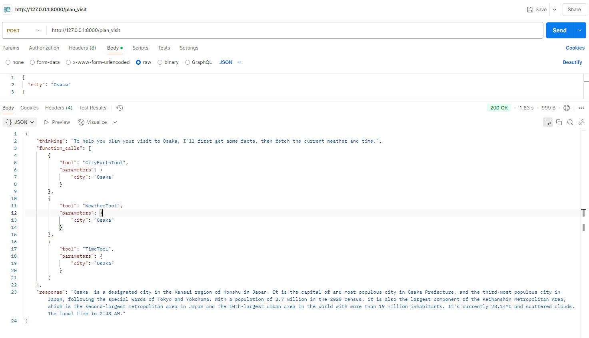

# 🌆 City Information Assistant

A FastAPI-powered AI Agent that delivers accurate, real-time information about any city using modern API orchestration.



## ✨ Features
- 🌤️ **Live Weather**: Current temperature and sky conditions
- 🕒 **Local Time**: Real-time clock based on city location
- 🌍 **City Facts**: Country, population, and a brief Wikipedia summary
- 🤖 **Transparent Reasoning**: Shows tool calls and agent "thinking"
- 🛠️ **Robust Tooling**: Utilizes OpenWeatherMap, TimeZoneDB, and Wikipedia APIs
- 💡 **Graceful Fallbacks**: Continues functioning with mocked data if APIs fail

## 🔗 API Endpoint
**POST** `/plan_visit`

### 🧾 Request
```json
{
  "city": "Paris"
}
```

### 🧾 Example Response
```json
{
  "thinking": "To help you plan your visit to Paris, I'll first get some facts, then fetch the current weather and time.",
  "function_calls": [
    {"tool": "CityFactsTool", "parameters": {"city": "Paris"}},
    {"tool": "WeatherTool", "parameters": {"city": "Paris"}},
    {"tool": "TimeTool", "parameters": {"city": "Paris"}}
  ],
  "response": "Paris is the capital city of France... It's currently 23°C and clear skies. The local time is 2:45 PM."
}
```

## 🧪 Run Locally
```bash
pip install -r requirements.txt
uvicorn main:app --reload
```

## 🧾 Environment Setup
Create a `.env` file in the root directory:
```env
OPENWEATHER_API_KEY=your_openweathermap_api_key
TIMEZONEDB_API_KEY=your_timezonedb_api_key
```

---

### 🚀 Why This Project Stands Out
- Designed with agent-style orchestration and tool chaining
- Modular architecture that’s testable, extendable, and production-ready
- Provides a clean JSON output format suitable for integration with frontend or other LLM agents